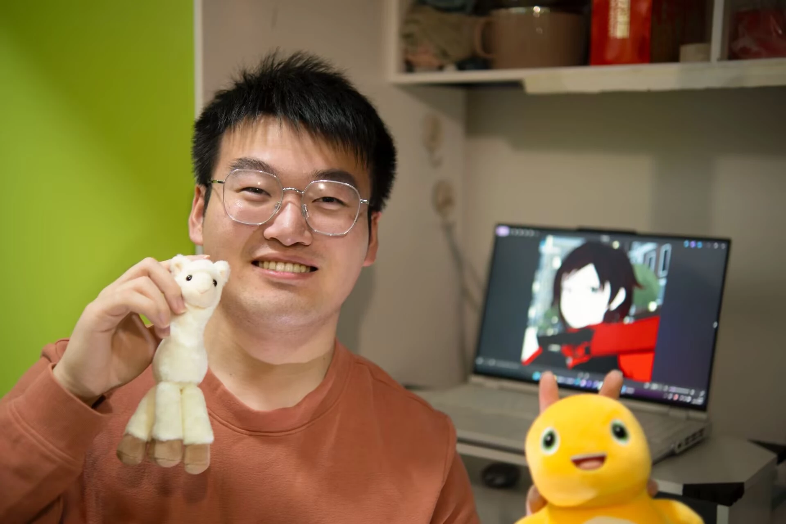

<!-- <title>Haodong Cui 崔浩东</title> -->

<!--  -->
<!--  -->

## 😍 About me

**Haodong Cui 崔浩东**

E-mail: cuihd2004@163.com

[[Github](https://github.com/haodongcui)]
[[ORCID](https://orcid.org/0009-0008-0029-0921)]

I am currently an undergraduate student at Xinjiang University and will be pursuing my master's degree at Huazhong University of Science and Technology in 2026. My undergraduate GPA ranks 1 out of 120.

## 📝 Publications

## 📖 Education
- 2026.09-2029.06, Master of Control Science, Huazhong University of Science and Technology
- 2022.09-2026.06, Bachelor of Mathematics and Applied Mathematics, Xinjiang University
    - GPA ranks 1 out of 120

## 🏅 Honors and Awards
- 2025.11, Merit Student Pacemaker, Xinjiang University
- 2025.10, National Scholarship, Xinjiang University
- 2025.01, Meritorious Winner, American Mathematical Contest in Modeling
- 2024.11, Provincial First Prize, Chinese Mathematical Contest

## 💽 Projects
- [LLMs学习归档](https://github.com/haodongcui/Archive-LLMs/)
- [2025美赛论文](https://haodongcui.github.io/files/2025comapPaper.pdf)
- [XJU-Math-Wiki](https://haodongcui.github.io/xju-math-wiki/)
- [魔改vitepress主题](https://github.com/haodongcui/vitepress-pure-blog)

